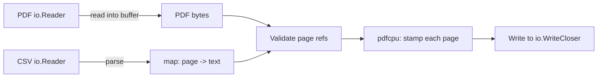

# PDF Watermark Go Library

## Requirements Summary

- **Input 1:** PDF template as `io.Reader`
- **Input 2:** CSV watermark data as `io.Reader` with format: `page_number,watermark_text`
- **Output:** Watermarked PDF written to `io.WriteCloser` (caller manages Close)
- **Watermark style:** Text-only, centered diagonally, semi-transparent gray, 45-degree rotation (fixed defaults)
- **Page handling:** Pages not listed in CSV are passed through untouched
- **Error handling:** Strict — return error if CSV references a page that doesn't exist in the PDF
- **Concurrency:** Safe for concurrent use from multiple goroutines
- **PDF engine:** `pdfcpu` (pure Go, no CGO)

## CSV Format

```
page,watermark_text
1,CONFIDENTIAL
3,DRAFT
5,INTERNAL USE ONLY
```

- Header row is expected and skipped
- `page` is 1-indexed
- Each row applies one watermark to one page
- Multiple rows for the same page are an error (strict)

## Public API Design

```go
package pdfmark

// Watermark reads a PDF from src, applies text watermarks per the CSV
// instructions from csv, and writes the resulting PDF to dst.
// The caller is responsible for closing dst.
func Watermark(dst io.WriteCloser, src io.Reader, csv io.Reader) error
```

Single function, zero configuration, production-ready defaults. This keeps the API minimal and hard to misuse.

## Data Flow




## Project Structure

```
pdfmark/
  go.mod                  -- module: github.com/anujkumar-df/pdfmark
  go.sum
  watermark.go            -- public API: Watermark() function
  csv.go                  -- CSV parsing into internal instruction map
  stamp.go                -- pdfcpu watermark application logic
  errors.go               -- sentinel errors and error types
  watermark_test.go       -- integration tests (end-to-end)
  csv_test.go             -- unit tests for CSV parsing
  stamp_test.go           -- unit tests for stamping logic
  testdata/
    template.pdf          -- sample 5-page PDF for tests
    valid.csv             -- valid CSV input
    invalid_page.csv      -- CSV referencing non-existent page
    duplicate_page.csv    -- CSV with duplicate page entries
    empty.csv             -- empty CSV (header only, no watermarks)
    malformed.csv         -- bad CSV format
```

## Key Internal Types

```go
// instruction represents a single watermark directive.
type instruction struct {
    Page int
    Text string
}

// parseCSV reads the CSV from r and returns a map[int]string (page -> text).
// Returns error on duplicate pages, missing fields, or non-integer page numbers.
func parseCSV(r io.Reader) (map[int]string, error)
```

## Stamping Strategy (pdfcpu)

1. Read PDF bytes from `io.Reader` into memory (pdfcpu needs `io.ReadSeeker`, so buffer first).
2. Parse the CSV into `map[int]string`.
3. Validate: check that every page number in the map exists in the PDF (total page count). If not, return a descriptive error.
4. For each entry in the map, use `pdfcpu`'s watermark/stamp API to apply a text stamp:
  - Text: from CSV
  - Rotation: 45 degrees (diagonal)
  - Opacity: 0.3 (semi-transparent)
  - Color: gray
  - Scale: relative to page size
  - Position: centered
5. Write the final PDF to `dst`.

pdfcpu provides `api.AddWatermarksFile` / `api.AddWatermarks` which accept page selection strings and watermark descriptors. We will call this per unique watermark text, grouping pages that share the same text.

## Concurrency Safety

The function is stateless — no package-level mutable state. Each call to `Watermark()` operates on its own local buffers and pdfcpu context. This makes it inherently safe for concurrent use.

## Error Scenarios (all return `error`)


| Scenario                          | Error               |
| --------------------------------- | ------------------- |
| CSV references page > total pages | `ErrPageOutOfRange` |
| CSV references page <= 0          | `ErrInvalidPage`    |
| Duplicate page in CSV             | `ErrDuplicatePage`  |
| Malformed CSV row                 | `ErrMalformedCSV`   |
| Invalid/corrupt PDF input         | `ErrInvalidPDF`     |
| Write failure to dst              | wrapped I/O error   |


## Test Plan

- **csv_test.go:** Valid CSV parsing, empty CSV, duplicate page, non-integer page, missing columns, extra columns, header-only
- **stamp_test.go:** Single page stamp, multi-page stamp, verify output is valid PDF, verify unstamped pages are unchanged
- **watermark_test.go (integration):** Full end-to-end: load a real PDF, apply watermarks via CSV, verify output PDF page count matches input, verify watermarked pages contain watermark text (via pdfcpu inspection), verify error cases (bad page, bad PDF, bad CSV)
- **Concurrency test:** Launch multiple goroutines calling `Watermark()` concurrently on the same input to verify safety

## Dependencies

- `github.com/pdfcpu/pdfcpu` — PDF manipulation (pure Go)
- Standard library only for everything else (`encoding/csv`, `io`, `bytes`, `fmt`, `strconv`)

